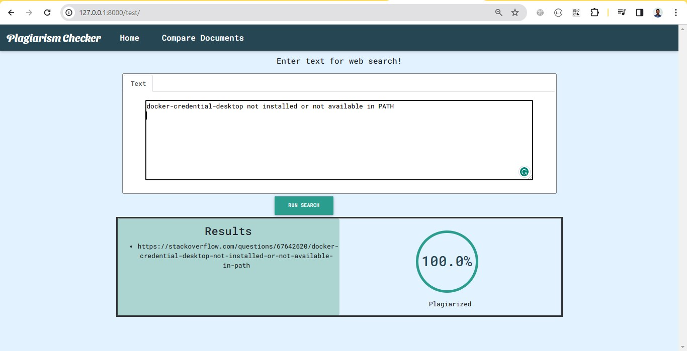

# Plagiarism_Checker_Cosine_Algorithm

Plagiarism checker using cosine similarity algorithm in Django.

## How to Run?

Follow these steps to set up and run the Plagiarism Checker:

### Prerequisites

- Python: Make sure you have Python installed on your machine. You can download it from [python.org](https://www.python.org/downloads/).

### Installation

1. Clone the repository:

    ```bash
    git clone https://github.com/Emmanuel-Adukpe-1061/Plagiarism_Checker_Cosine_Algorithm.git
    cd Plagiarism_Checker_Cosine_Algorithm
    ```

2. Install the required Python packages:

    ```bash
    pip install -r requirements.txt
    ```

   This will install Django and other dependencies.

3. Download NLTK data:
    Run the following command..
    ```bash
    python setup.py 
    ```

    ```bash
    python -m nltk.downloader punkt
    python -m nltk.downloader stopwords
    ```

### Run the Project

1. Run the Django development server:

    ```bash
    python manage.py runserver
    ```

   This will start the development server at `http://127.0.0.1:8000/`.

2. Access the Plagiarism Checker in your web browser:

   Open your web browser and navigate to [http://127.0.0.1:8000/](http://127.0.0.1:8000/).

### Screenshots

Include screenshots of the Plagiarism Checker in action. Add the image links in the table.

<table>
  <tr>
    <td>Plagiarism Checker</td>
  </tr>
  <tr>
    <td></td>
  </tr>
</table>
